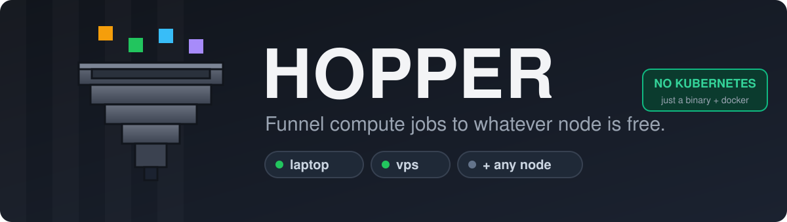

<p align="center">
  
</p>

<p align="center">
  <a href="https://github.com/mcpeixoto/hopper/actions/workflows/ci.yml"></a>
  <a href="https://github.com/mcpeixoto/hopper/releases"></a>
  
  <a href="LICENSE"></a>
  
</p>

# Hopper

**Hopper is a tiny distributed job runner.** You submit a job — a Docker image plus a
command — to a small control plane, and any worker node that's free claims it, runs it, and
streams the result back. Like the Minecraft block it's named after, Hopper *collects work
and funnels it into the machine below*.

It fills the gap between "SSH in and run it by hand" and standing up Kubernetes: you have a
few machines with Docker and you want to run work across them — batch jobs, builds, CI,
renders, scrapers, ML experiments — without operating a cluster. One static binary per role,
SQLite for state, Docker for execution. **No Kubernetes, no Terraform, no message broker, no
control plane to babysit.**

```
   jobs ──▶  ┌──────────────┐                ┌──────────── worker node (often behind NAT) ────┐
             │   hopperd    │ ◀── long-poll ─┤  hopper-agent → docker run <image> <command>   │
   console ─▶│  (control    │     claim       │  reports exit code + logs, heartbeats          │
   CLI/API ─▶│   plane)     │ ──── job ──────▶│                                                │
             │  SQLite queue│                 └────────────────────────────────────────────────┘
             └──────────────┘    reaper requeues a dead node's job automatically
```

Workers **pull** work over outbound HTTPS, so a node behind NAT, on home Wi-Fi, or on another
cloud needs **no public IP, no port-forward, no tunnel** — only outbound access to the control
plane. Adding a node is one script. That's the whole story.

## Who it's for

- **Home labs & self-hosters** — put that pile of mini-PCs, NUCs, and old laptops to work.
- **Small teams** — a shared build/CI/batch runner without a platform team or a K8s bill.
- **Researchers & ML folks** — fan experiments out across whatever boxes (and GPUs) you have;
  route GPU jobs with labels.
- **CI** — run GitHub Actions on your own hardware as ephemeral runners (no cluster).
- **Render / encode / scrape farms** — queue thousands of containerized jobs across mixed
  machines, on or off the same network.
- **Edge / multi-cloud fleets** — nodes anywhere with outbound HTTPS join the same pool.

If your workload fits in a container and you'd rather not run Kubernetes, Hopper is for you.

---

## Why Hopper?

- 🪶 **Static Go binaries.** `hopperd` (server), `hopper-agent` (worker), `hopper` (CLI). No
  runtime, no daemonset, no Helm chart.
- 🧲 **Pull-based.** Nodes dial out to the control plane. NAT, dynamic IPs, and coffee-shop
  Wi-Fi all just work.
- 🗃️ **SQLite *is* the queue.** Durable FIFO + priority + leases, zero extra services.
- ♻️ **Self-healing.** A claimed job has a lease; if a node dies, the reaper requeues the job.
- 🐳 **Runs anything.** If it's a Docker image, Hopper can run it — with CPU/memory caps and
  `--network none` by default.
- 📦 **Inputs & outputs.** Send a directory in, get a directory out (content-addressed blobs);
  logs and exit codes captured.
- 🖥️ **Two GUIs + a CLI.** An operator console (submit/watch jobs + fleet), a per-node
  console, and `hopper submit/jobs/result/...`.
- ⬆️ **Opt-in auto-update, signed.** Tag a release; your fleet self-updates after Ed25519
  signature + checksum verification.
- 🏃 **Distributed CI.** Run your GitHub Actions jobs on your own nodes (ephemeral runners).
- 📈 **Observability.** `/metrics` (Prometheus), structured logs, rate limiting, panic recovery.

## Quickstart

> Needs Go 1.22+ to build (or grab a binary from [Releases](https://github.com/mcpeixoto/hopper/releases)), and Docker on every worker node.

**1. Run the control plane** (on any host your nodes can reach over HTTPS — a VPS, a server,
a container):

```bash
git clone https://github.com/mcpeixoto/hopper && cd hopper
export HOPPER_OPERATOR_TOKEN=$(openssl rand -hex 32)
export HOPPER_NODE_TOKEN=$(openssl rand -hex 32)
make run-server          # listens on :8080
```

**2. Start a worker** (on any machine with Docker — a server, a workstation, a laptop, a
cloud VM):

```bash
HOPPER_CONTROL_URL=http://localhost:8080 \
HOPPER_NODE_TOKEN=$HOPPER_NODE_TOKEN \
make run-agent
```

…or onboard a remote node with a single command:

```bash
curl -fsSL https://raw.githubusercontent.com/mcpeixoto/hopper/main/scripts/install-worker.sh | \
  HOPPER_CONTROL_URL=https://hopper.example.com HOPPER_NODE_TOKEN=xxxx bash
```

**3. Submit a job:**

```bash
curl -s -X POST localhost:8080/api/jobs \
  -H "Authorization: Bearer $HOPPER_OPERATOR_TOKEN" \
  -d '{"image":"alpine:3.20","command":["echo","hello from hopper"]}'

# then watch it: GET /api/jobs/<id>  →  status: queued → in_flight → done
```

That's it — the worker pulled the image, ran the command, and reported the result.

## Components

| Piece | What it is | Runs where |
|-------|------------|------------|
| **`hopperd`** | Control plane: job queue, worker registry, artifact store, lease reaper | One always-on host (VPS, server, container) |
| **`hopper-agent`** | Worker: pulls jobs, runs Docker, reports results, serves a local node console | Every node (server, workstation, VM, …) |
| **web console** | Operator GUI: submit jobs, watch the queue + fleet, read logs | Browser → `hopperd` |
| **node console** | Per-node GUI: this machine's state, current job, live logs | Browser → `hopper-agent` (loopback) |

## Configuration

Everything is environment variables (see [`.env.example`](.env.example) and the
[configuration reference](docs/configuration.md)). The essentials:

| Variable | Side | Meaning |
|----------|------|---------|
| `HOPPER_OPERATOR_TOKEN` | server | bearer token to submit jobs / use the console |
| `HOPPER_NODE_TOKEN` | both | bearer token nodes use to claim work |
| `HOPPER_CONTROL_URL` | client | where the control plane lives |
| `HOPPER_LABELS` | client | capabilities this node advertises (e.g. `gpu,bigmem`) |
| `HOPPER_AUTOUPDATE` | both | set to `1` to self-update from releases |

## ⚠️ Trust boundary — read this

A worker runs **whatever image and command the control plane tells it to**, as the Docker
daemon (effectively root on that machine). That is fine **only because every node and the
control plane are *yours* — a single trust domain, not a multi-tenant service.** Hopper caps
CPU/memory and defaults to `--network none`, but those are guardrails, not a sandbox.

**Do not point a worker at a control plane you don't fully control, and don't submit jobs
you wouldn't run as root on that node.** If you need multi-tenant isolation, you need
gVisor/Kata/Firecracker — that's out of scope. See [docs/security.md](docs/security.md).

## Why not Kubernetes / Nomad / Terraform?

For a handful of trusted machines they cost more than they give. K8s and Nomad assume the
control plane can reach the workers (the NAT problem comes right back), plus a cluster to
operate. Terraform provisions infra; Hopper runs on machines you already have. A broker
(Redis/Celery) is one more stateful service to run and back up. Hopper's bet is the same one
a SQLite-backed app makes: **the database is enough.**

Outgrow it when you need what a real cluster gives — job-to-job networking, autoscaling node
pools, fine-grained bin-packing, or multi-tenant isolation of untrusted code. Until then, a
pull queue is the right tool. More in the [architecture docs](docs/architecture.md).

## Documentation

📚 Full docs live in [`docs/`](docs/):
[Architecture](docs/architecture.md) ·
[Quickstart](docs/quickstart.md) ·
[Control plane](docs/server.md) ·
[Worker nodes](docs/client.md) ·
[API reference](docs/api.md) ·
[Configuration](docs/configuration.md) ·
[Releases & auto-update](docs/releases.md) ·
[Security](docs/security.md) ·
[Roadmap](docs/roadmap.md)

## Development

```bash
make build        # compile hopperd + hopper-agent into ./bin
make test         # run the test suite
make fmt vet      # format + vet
make dist         # cross-compile release binaries + checksums
```

See [CONTRIBUTING.md](CONTRIBUTING.md). Every new function gets a test; docs stay in sync
with the code.

## License

[MIT](LICENSE) © Hopper contributors.

<sub>Hopper is an independent project and is not affiliated with or endorsed by Mojang or
Microsoft. The hopper artwork is original; no Minecraft assets are used.</sub>
